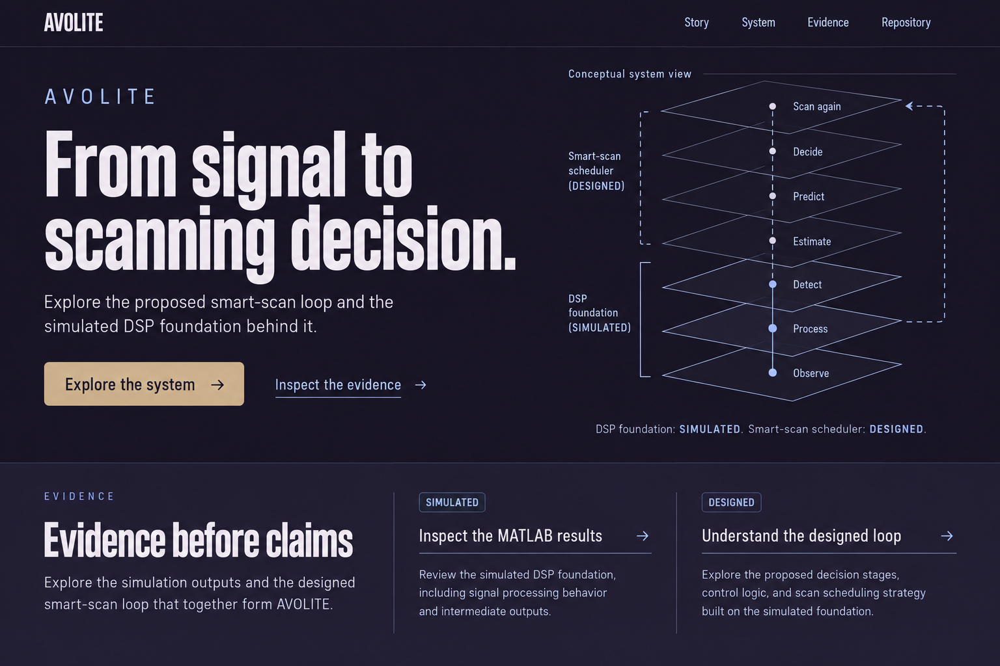

# AVOLITE — complete redesign proposal
Date: 1 October 2026

Status: **Exhibition Cutaway selected by the user. Planning and mockup phase; application implementation has not started.**

> **2 October 2026 — layout and interaction decisions:** [EXPERIENCE-SPEC.md](EXPERIENCE-SPEC.md) now defines exact section coverage, placement, spacing, responsive behavior, components, animation timings and states. It preserves the introduction and all eight Avoflare-equivalent sections on one main page, with System and Evidence as supplementary routes. Where this earlier proposal differs, the experience specification takes precedence. The selected hero remains unchanged.

## Selected direction — Exhibition Cutaway
The user confirmed the exact original Exhibition Cutaway image by attachment on 1 October 2026. This resolves the previous comparison-page ambiguity and supersedes both earlier recommendations.

Preserve the plum hero, oversized condensed headline, khaki primary action, pale layered diagram, and dark evidence shelf shown in this reference. Carry the earlier request for light colors into deeper evidence/detail sections, using cool pearl #F4F2F7 with dark plum #171322 text. This is a supporting treatment to develop, not a replacement hero or a separately approved page composition. The architecture, data honesty, accessibility and motion requirements below continue to apply. Selected reference and approval are recorded in exhibition.json and the homepage surface brief.

## Previous exploration — light colors and stronger visual craft
The user requested a light-color reroll, then chose the original Exhibition Cutaway. The light alternatives below are retained as exploration history only.

The [comparison page](http://127.0.0.1:54168/) previously presented:
- **Engineering Folio:** porcelain and sage, a wide conceptual flow, and a contrasting forest-green evidence chapter.
- **Review Pavilion — unselected:** a bright architectural layout, confident cobalt diagram plane, large typography and generous spacing.
- **Precision Light:** a restrained white/platinum alternative with a vertical system diagram and a conventional evidence directory.

Refinement means stronger hierarchy, deliberate whitespace, accurate diagram annotations, coherent page-wide color fields, and polished interaction states. No extra decorative motion is needed. Light surfaces may alternate with dark or saturated chapters; a theme switch is not required. The page architecture, accessible motion plan, evidence rules and GSD sequence below still apply.

### Revised palette proposal
| Role | Engineering Folio | Review Pavilion | Precision Light |
|---|---|---|---|
| Page | #F7F9F5 | #F7F9FC | #FFFFFF |
| Pale surface | #E2EBE2 | #E7EDF8 | #F0F3F7 |
| Heading | #152E2A | #182342 | #182839 |
| Body / caption | #526761 | #56637B | #405D78 |
| Primary action / focus | #152E2A | #193FE5 | #214DA8 |
| Contrasting chapter | #152E2A | #193FE5 | #182839 |
| Text on contrasting chapter | #F7F9F5 | #FFFFFF | #FFFFFF |

Calculated minimum heading/body contrast on the listed light surfaces: Folio **4.96:1**, Pavilion **5.15:1**, Precision **6.18:1**. These are token calculations, not a rendered accessibility certification. Use #56637B for Pavilion secondary text in implementation even where the concept raster looks paler. Brass on Folio is decorative only. Adjust the six status tokens for light surfaces with text/glyph distinctions intact. Rendered borders, badges and focus indicators require their own checks.

The generated logo text, occasional serif note, broad icon meanings and tiny caption styles are not approved brand/type changes. Restore the supplied Logo and specified font families at implementation. Diagram flows remain explicitly illustrative; numerical charts still use real exports only. Exhibition Cutaway below is selected; all other options are history.

## 1. Decision and brief
Keep SIH judges as the primary audience. Prioritize quality over the former 2 October deadline. Deliver mockups and a complete plan first. Reuse the existing Astro foundation and data protections.

The site must answer, in order:
1. What problem is AVOLITE addressing?
2. How would the proposed scan decision loop work?
3. What exists today, and what evidence supports it?
4. What remains to be implemented or validated?

A judge's quick path should be possible from the home page alone; deeper pages support scrutiny. Do not force animation, a video, or an interactive toy to understand the project.

**Selected: Exhibition Cutaway.** Preserve the exact chosen hero composition and use lighter supporting surfaces where helpful for reading evidence.

[Open the local comparison board](http://127.0.0.1:54168/). Local board works while its helper is running; the images below persist in this repository.

## 2. Original visual mockups — Exhibition Cutaway selected

### A. Exhibition Cutaway — selected

Matte plum environment, very large compressed type, one dominant layered system drawing, exhibit-style captions, and a wide evidence shelf. The signature interaction steps through the layers while retaining a visible distinction between DSP evidence and proposed scheduling.

Risk: the cutaway must remain a conceptual diagram, with no suggestion of fabricated hardware geometry. The generated image's bottom-up arrangement must gain an explicit starting point and reading order in implementation.

### B. Signal Atlas — unselected

Marine surfaces, wide type, a strong chapter index, and pale technical plates. Judges can orient themselves, read the whole loop, then inspect the evidence without changing visual vocabulary.

Risk: familiar engineering presentation. Distinctiveness comes from diagram craft, composition, annotation and precise movement, rather than decoration.

### C. Instrument Console

Navy panels, restrained cyan, a circular process diagram and flat evidence rows. This retains more of the original aesthetic.

Risk: less distinctive. Circular layout must not imply a measured spatial response or actual scanning telemetry.

### Mockup limits and corrections before build
These are generated visual concepts, not implementation screenshots or technical evidence. Their copy and geometry are not the engineering specification.
- Replace all generated wordmarks with the supplied cleaned Logo component.
- Remove decorative arrows appended to buttons and unnecessary uppercase copy.
- Replace softened/gradient raster surfaces with the specified flat surfaces.
- Give diagram nodes accurate **per-node** status; grouping the first three stages under SIMULATED must never imply an integrated ES receive chain was validated. Add: “Radar DSP testbed evidence; ES integration remains designed.”
- The Scan again feedback path remains DESIGNED. Draw it distinctly from the simulated radar DSP subpath.
- Real MATLAB charts remain unmodified white plates. Never recreate their values with image generation.
- Final type wraps, contrast, focus states, mobile layout, links and controls are implementation responsibilities.
- Exhibition Cutaway's direction and desktop hero are approved. Develop mobile and evidence-page layouts within that identity; do not reopen the chosen hero or infer technical claims from the generated image.

## 3. Site architecture
Three public content routes, plus the existing internal component preview. This is a proposed change from the earlier single-page-only scope.

| Route | Judge's task | Content | Primary onward action |
|---|---|---|---|
| / | Understand the argument quickly | Problem, conceptual loop, current proof, proposed novelty, demo status, safeguards, roadmap, why it matters | Inspect evidence |
| /system/ | Examine architecture and boundaries | Seven-stage loop, implemented/designed boundary, proposed AI decisions, failure handling, requirements map | See supporting evidence |
| /evidence/ | Verify what is actually supported | Scenario context, exported metrics, original plots, target table, provenance, limitations, pending evidence | Open source repository |
| /preview/ | Internal component QA | Existing primitive gallery plus redesigned states | No public navigation; keep noindex |
| /404.html | Recover from a broken link | Plain missing-page explanation, Story and Evidence links | Return to story |

No empty documentation hierarchy, blog, dashboard app, login, contact form, or separate demo route. The current material supports two deep dives; missing assets do not justify more routes.

Global navigation: **Story / System / Evidence / Repository**. Home chapter links use absolute home anchors so they work from every route. Preserve the existing anchors problem, how, built, new, demo, security, roadmap, why as compatible destinations. Do not leave fragment-only links on /preview/.

Desktop: compact persistent header and context-aware chapter index. Tablet: header plus an inline chapter disclosure. Phone: logo, current page and menu button; navigation should work with JavaScript disabled. Avoid an eight-item horizontal tab bar.

## 4. Homepage storyboard
Keep all eight subjects from the current brief, organized as one argument. Chapter title, concise explanation, signature visual, evidence/status caption, then onward link is the repeated reading order.

| Region | Copy direction and content | Visual / interaction | Honesty boundary |
|---|---|---|---|
| Hero | “From signal to scanning decision.” Explain the proposed loop and its simulated DSP foundation in one sentence | Selected direction's dominant loop/cutaway; Explore the system / Inspect the evidence | Conceptual system view; explicit DSP versus scheduler status |
| problem | Why a fixed scanning policy can miss opportunities; what the problem statement asks for | Two schematic timelines with direct labels, identical scale and no performance percentages | ILLUSTRATIVE; do not infer a measured improvement |
| how | Observe, Process, Detect, Estimate, Predict, Decide, Scan again | Seven labelled stages, selected node explanation and input/output summary | Individual status and artifact link for every supported claim |
| built | What the available MATLAB work demonstrates | One original figure, source-backed Metric readouts, compact target table; SARRS framing directly above | SIMULATED radar DSP testbed; one named run only |
| new | Proposed adaptive decisions: cluster selection, skill selection and routing | Two clearly separated decision panels and a simple fast-path/escalation branch | DESIGNED; no AI success or latency claims |
| demo | Explore the mechanism; watch the demonstration when available | Manual step-through explainer; fixed-aspect pending video panel and repository link | Explainer ILLUSTRATIVE; missing video explicitly pending |
| security | Proposed checks, human review and fallback behavior | Three compact failure-to-response rows, each expandable | DESIGNED; not a claim of deployed safeguards |
| roadmap | What exists, what must be validated, what depends on hardware | Ordered milestone list with evidence gates | No unconfirmed “we are here” engineering stage; distinguish website progress |
| why | Why evaluate adaptive scanning, what would constitute success | Requirements-to-evidence links and cited external context | Research clearly separate from AVOLITE results |
| Footer | Team, project context, status legend, source and author | Quiet full lockup and link groups | Contact/team ID only when supplied |

Avoid hero metrics, invented scores, fake dashboards, “live” labels, capability claims from empty files, and full-screen launch animation. Main copy is actual selectable text.

## 5. Deep-dive page layouts

### System
Opening summary and DESIGNED scope notice; a persistent local table of contents on wide screens; main system diagram; one section per decision boundary; two-stage JEV/Event-Evidence explanation; adaptive router and fallback; requirement map; limitations and evidence links.

Layout: readable prose column beside an explanatory diagram on wide screens. Every interactive diagram has an ordered textual equivalent. The user can choose stages with ordinary buttons and previous/next controls. Stage changes never pretend to execute a model. Mobile renders diagrams as a vertical sequence, not a miniature desktop canvas.

Security stays concrete: proposed failure, proposed detection/check, proposed response, and implementation status. It is not an “active trust engine” or security certification.

### Evidence
Opening scope: the available exports are from a radar DSP/detection testbed, not validation of an integrated ES scheduler. Then:
1. Run identity, source commit/path, status and limitations.
2. Derived metrics using existing data.ts-issued values.
3. Original plots from the current figure registry, one principal plot at a time.
4. Expected versus detected target table; readable units and signed/absolute error distinctions.
5. Optional small dumbbell comparison derived solely from the same exported rows; reference and detected marks directly labelled.
6. Provenance and reproduction notes with repository links.
7. Pending evidence list: scheduler comparison, AoA validation, dashboard capture, demo video, SNR definition.

No merged scenarios, missing-data interpolation, synthetic confidence gauges, or SNR sweep claim until its definition is supplied. A five-target run is a scenario, not a general detection-rate benchmark. The Monte Carlo file with identical rows is not shown as a meaningful distribution.

## 6. Shared design system and first-round palette history
Use the Exhibition Cutaway column below for the selected dark hero. The other columns are historical alternatives. Add cool pearl #F4F2F7 with dark plum #171322 ink for supporting light surfaces; the second-round palettes do not replace this identity. No changes have been made to src/styles/tokens.css.

| Role | Exhibition Cutaway | Signal Atlas | Instrument Console |
|---|---|---|---|
| Page | #171322 | #0E252B | #07101F |
| Surface | #282237 | #193940 | #13223F |
| Heading | #EEEAF3 | #EAF0E9 | #E6EEF8 |
| Body | #C4BDD0 | #BDCED0 | #9BAEC8 |
| Caption | #ACA3BA | #A5BEC2 | #7B91B0 |
| Selection / focus | #B8C9ED | #D6C09B | #3BE4F2 |
| Accent | #CFB99A | #B5CBCD | #3BE4F2 |

Calculated minimum normal-text contrast across heading/body/caption on the two listed dark surfaces: **6.33:1**, **6.32:1**, **4.91:1**, respectively. This calculation does not certify a rendered UI. Pale diagram plates require separate dark-ink tokens and checks. Preserve real white chart plates and supplied logo colors. Do not use brand khaki as a substitute status color.

The selected dark plum hero leads the redesign; light supporting sections provide reading contrast. No theme toggle is required. Surface changes and border contrast create hierarchy, without shadow stacks, glassmorphism, decorative glow, or ambient particle fields.

Typography: reuse the already self-hosted Archivo, IBM Plex Sans and IBM Plex Mono. They already satisfy the technical reading role and font budget; a font migration has no demonstrated benefit. Adjust Archivo width/weight for the selected composition. Proposed scale: display 48–96px, h2 34–56px, h3 22–28px, body 17–18px at 1.6, captions 14px. Mono only for units, IDs and compact technical labels. Keep prose at 60–68ch. Large headings must wrap intentionally on phones.

Layout: retain the 1440px outer frame, 12/8/4-column breakpoints and 80/40/16px margins. A desktop chapter rail consumes actual grid columns; it never overlays text. Use 24px gutters, 4px spacing scale, 4px panel/button radius, 2px status-chip radius. Section spacing roughly 96–128px desktop and 56–72px phone; trim empty space in dense evidence pages.

## 7. Components and states
Reuse Logo, StatusTag, StatusLegend, Metric, Figure, Placeholder, ResultTable, TableDisclosure, SkipLink, Header and MobileMenu. Extend rather than create parallel systems.

Only introduce components when used by real page content:
- **Chapter navigation:** default/current/visited/focus; current section indicated by text or shape and aria-current.
- **System diagram:** neutral/selected stage; stage explanations remain available without motion.
- **Evidence link:** claim, status, source, scope; no unsupported “verified” stamp.
- **Decision walkthrough:** previous/next/restart; no fictional computed outcomes.
- **Pending evidence panel:** names the missing asset and what it would establish; no indefinite loading spinner.
- **Figure viewer:** normal plate, expanded view if valuable, caption, source and accessible alternative.
- **Roadmap row:** current evidence, required proof, dependency; no arbitrary dates or fake percentages.

Buttons remain CSS classes on native elements. Navigation uses links; state changes use buttons. Provide hover, active, focus-visible, disabled (only when meaningful), pending and unavailable states. Minimum target 44px. Keep links identifiable without color alone.

Status is a stable six-value vocabulary. Glyph, label and border remain usable in grayscale; pass/fail treatment is reserved for a defined test with evidence. Do not make DESIGNED appear “failed.”

## 8. Motion and transitions
Purpose: make relationships and user actions easier to follow. No scroll hijacking, generic section fades, card lifts, drifting backgrounds, parallax, cursor replacement, or forced cinematic delay.

| Moment | Trigger | Proposed timing | Reduced motion / phone |
|---|---|---|---|
| Navigation feedback | Hover/focus/activation | 120–180ms color/opacity | Immediate feedback; focus always visible |
| Stage selection | Button/step selection | 200–280ms connector emphasis and 8–16px bounded diagram transform | Immediate stage and caption update |
| Signal explanation | Explicit Play | One 4–6s illustrative pass; pause/replay visible | Manual steps; no autoplay |
| Desktop story diagram | Section intersection | 240–360ms emphasis of the corresponding stage | Static diagram plus ordered sections; no pinning under 768px |
| Evidence selection | User selects figure/run | 120–180ms plate swap, stable dimensions | Immediate swap; selected source stays visible |
| Optional plot stroke reveal | User requests replay | 450–600ms stroke reveal only | Complete plot always visible |
| Page navigation | Ordinary link | Optional native cross-document transition, 140–180ms | Standard navigation fallback; disabled for reduced motion |
| Disclosure/menu | User action | At most 160–200ms opacity/transform | Native state change, no opening delay |

Final state is server-rendered. Metrics never count up or tween between values. Automatic animation, if added at all, pauses offscreen and when the page is hidden; no hidden CPU loops. No flashing patterns.

Prefer native CSS and small existing TypeScript. Use feature detection for progressive scroll/navigation effects. No animation dependency by default. If the selected cutaway requires coordinated sequencing beyond simple CSS, validate a small GSAP-only prototype against the byte budget before adding it; avoid unused plugins and ScrollSmoother. Confirm APIs in Context7 when implementing.

## 9. Responsive and accessible behavior
- **1440:** dominant graphic with full labels, chapter index, readable two-column technical sections.
- **768:** two-column regions only where labels remain legible; chapter index becomes disclosure; no compressed navigation labels.
- **390:** one column, headline before graphic, vertical loop, full-width controls where useful, figures maintain aspect, table disclosure/card view.
- No horizontal page scroll. A technical table may have its own named keyboard-accessible overflow region when needed; retain the existing mobile rendering.
- Test 200% zoom and reflow. No clipped headings, fixed-height text cards, or sticky obstruction of focused elements.
- Keyboard and touch can reach every stage and evidence item. Hover reveals no essential information.
- SVG title/description and a textual diagram alternative; charts retain table access.
- Explicit width/height for images; no missing-asset layout jumps.
- JavaScript off: all copy, evidence, links and selected default views remain present. The mobile navigation must allow reaching content without trapping an open dialog.
- Reduced motion: no looping scan, pinned storytelling or animated route transition; all controls still work.
- Video only after delivery, with poster, controls, captions/transcript and no autoplay.

## 10. Assets and technical scope
Use the supplied logo, existing self-hosted fonts, original MATLAB figures, SVG diagrams and CSS. No stock imagery. Mood scenes are optional and low priority; they must not look like AVOLITE hardware evidence. The generated mockup PNGs are design references only, not page-sized production backgrounds.

Astro remains static. Standard multi-page navigation is sufficient; do not add ClientRouter solely for transitions. Source content may live in typed TS or Astro content components. Keep narrative content out of strict results and claims objects unless its schema is explicitly extended and tested.

Preserve data ingestion, hashes, strict zod validation, computed values, issued-value checks and figure provenance. The old 03-01 draft incorrectly assumes extra keys can be added to claims.json; replace that step before execution. Prefer a separate narrative module.

## 11. GSD continuation and implementation sequence
Continue the current project. Phases 1 and 2 remain completed foundations, with targeted corrections; no new-project reset. Do not execute the stale Phase 3 draft.

| Stage | Work | Exit evidence |
|---|---|---|
| Design development | Exhibition Cutaway selected; develop mobile and evidence-page compositions within this world and resolve navigation scope | Recorded choice and homepage contract; remaining page compositions |
| GSD reconciliation | Repair usable runtime paths; align PROJECT/REQUIREMENTS/ROADMAP/STATE and repository guidance; remove obsolete deadline and stale source references | One consistent current plan with requirement mapping |
| 3A: Foundation refinement | Selected tokens, header/menu/navigation, statuses, typography and existing review findings | Primitive gallery; no broken route anchors; data protections unchanged |
| 3B: Complete static site | Home story plus System and Evidence, real figures/results, clear pending states, metadata/404 | Complete judge journey with JavaScript off |
| 4: Useful interactions | Stage selection, walkthrough and evidence controls; then motion layer | Keyboard/touch/reduced-motion behavior; animation removable without lost content |
| 5: Team assets | Video/screenshots/verified source updates as available, no fabricated substitutes | Correct asset scope/status, fixed geometry, accessible alternatives |
| 6: QA and launch readiness | Cross-browser, visual, accessibility, performance, claim/source audit | Recorded checks and preview ready; public deploy only when requested |

No replacement calendar promise. Estimate dates after the visual scope is chosen; team evidence dependencies should not block shipping an honest pending state.

Repair the four current audit warnings as part of 3A: invalid output statuses, wording-check normalization, cross-route preview anchors, and JS-off mobile-menu behavior. Add targeted regression cases for these concrete failures. Resolve plain-prose numeric claim coverage before adding long-form result copy.

## 12. Acceptance checks
Reuse current scripts and test setup. The prior audit passed 99 node tests and 32 Chromium E2E checks; those results cover the existing shell/data scope, not the redesign.
- npm run check, npm test, npm run build.
- Playwright screenshots at 1440, 768, 390; inspect homepage and both deep dives, not only the opening viewport.
- Extend the currently Chromium-only setup to Firefox/WebKit; run navigation, keyboard, JS-off, reduced-motion and axe checks.
- Verify all source links, route anchors, current-page labels, back navigation and pending states.
- Compare displayed metrics to the issued dataset; verify no invented claims in generated copy or diagrams.
- CSS budget ≤25KB, fonts ≤130KB, homepage JS ≤70KB gzip. Aim for near-zero script on Evidence beyond shared navigation; review extra script rather than assume budget compliance.
- Target LCP ≤2s, CLS ≤0.05, INP ≤150ms and Lighthouse mobile ≥90 performance, 100 accessibility/SEO. These are targets, not measured achievements; lab checks cannot certify field INP.
- Contrast includes focus, statuses and light plot plates. Automated axe does not replace keyboard or diagram review.
- Rebuild/update graphify after substantial implementation if the required tooling is available; graph remains a local ignored artifact.
- Final design review compares the implementation to the approved comp, then records the shipped design in DESIGN.md.

## 13. Research and constraints
- [NASA Eyes](https://science.nasa.gov/eyes/): reference for making a complex system explorable with visible context. Inspiration only; no NASA graphics or results are AVOLITE evidence.
- [Helsing](https://helsing.ai/): reference for concise chapter descriptions and explicit onward links. Content hierarchy observed from its page; no claim that its animation was audited.
- [Astro view transitions documentation](https://docs.astro.build/en/guides/view-transitions/): native cross-document transitions can enhance a static multi-page site without ClientRouter; ClientRouter adds lifecycle considerations. Retrieved through Context7 for this plan.
- Modern-web-guidance was consulted for progressive scroll effects and static/reduced-motion fallbacks. Exact browser support must be feature-detected at implementation.
- The repository-pinned **dataviz skill was not found** in the installed skill locations. This plan uses existing data components and explicit chart requirements; it does not claim that skill was run. Resolve the missing skill before specialized chart implementation if it remains mandatory.
- The current AGENTS/CLAUDE documents and some GSD plans describe an obsolete data/model/site shape. The present audit and PROJECT.md identify the actual implemented six-status system. Reconcile guidance before coding; never “fix” the data layer to match obsolete conceptual AoA numbers.

## 14. Pending decisions and inputs
**Design decision recorded:** Exhibition Cutaway, confirmed by image attachment. The choice does not approve fabricated copy, geometry or outcomes in the generated mockup. Mobile and supporting-page layouts remain design work within the selected world.

**Content inputs later:** official problem wording, team ID, video, dashboard captures, AoA/scheduler evidence, SNR definition, confirmed engineering roadmap stage, Cloudflare project URL. No new authentication or installation is required to review the mockups.

Application source files remain unchanged in this planning round.
